#Describing the Project and Looking at the Cleaned Data  

For this project, we were assigned to look at the IBTRACS data for storms in the North American basin, from 1851 through 2013. The data in its original hurdat format was taken from the IBTRACS website and then cleaned to make it feasible to analyze later in the project. The end result of this was creating the storms.csv and tracks.csv files that you see below. The bulk of the analysis will shrink the aforementioned time-frame to the 30 years between 1980 and 2010. 
   
```{r, echo=FALSE}
library(readr)
library(stringr)
library(ggplot2)
library(maps)
library(mapdata)
library(dplyr, warn.conflicts = FALSE)
library(knitr)
source("../code/source.R")
```


```{r, echo=TRUE}
head(storms)
head(tracks)
```
The four columns under storms are self-explanatory, with the names column outputting as missing due to the process of naming tropical storms not yet established in 1851. The eight columns of tracks are equally apparent, each relating to the condition or position of the storm.

#Categorizing each Storm and then Plotting Annual Frequencies 

This section will introduce nuance as to what constitutes a storm versus a tropical storm, a stage 1 hurricane, or a stage 3 hurricane.

First, the total number of storms per year from 1980-2010
```{r, echo=FALSE}
tapply(year_total$x, year_total$Group.2, length)
```
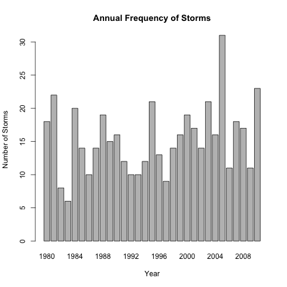

As is apparent from the plot, the total number of storms per year has fluctuated within a stable range, with the exception of 2005, which saw a total of 31 storms. 

Now, we will count the number of tropical storms per year in the same time-frame, where a wind speed of 35 knots or greater constitutes a tropical storm.

```{r, echo=FALSE}
tapply( group$x, group$Group.2, length)
```
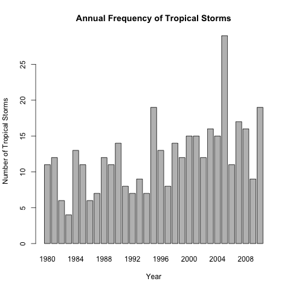

While the number of storms per year fluctuated in a relatively stable manner, plotting the number of tropical storms allows us to see a slight uptick in their number in recent years, indicating the increasing intensity of storms.

We now turn our eyes to the number of hurricanes per year, where a wind speed of 64 knots or greater indicates a hurricane. 

```{r, echo=FALSE}
tapply(group1$x, group1$Group.2, length)                 
```
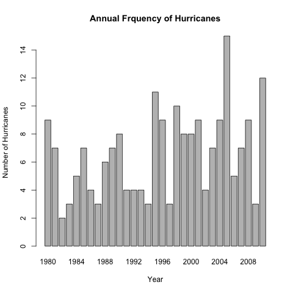

Once again we see a slight uptick in the number of hurricanes per year. This second occurrence then allows us to postulate as to the reason why. A possibility is that due to global warming, whereby humans produce such a great quantity of co2 emissions to induce a greenhouse effect, the intensity of storms has increased.

Lastly, we look at the number of stage 3 hurricanes per year, to add more credence to our hypothesis. 

```{r, echo=FALSE}
tapply(group2$x, group2$Group.2, length)
```
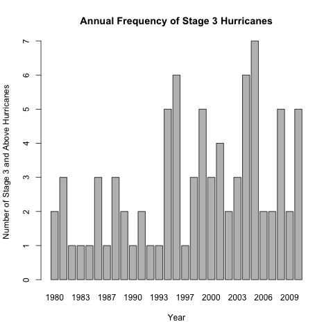

With this last plot, it is abundantly clear that storms have increased in intensity in recent years, an effect which can be attributed to global warming.

#Categorizing each Storm and then Plotting their Monthly Frequencies

This section will once again introduce nuance as to what constitutes a storm versus a tropical storm, a stage 1 hurricane, or a stage 3 hurricane, but will focus on monthly data instead of yearly.

First, the total number of storms per month from 1980-2010
```{r, echo=FALSE}
tapply(month$x, month$Group.2, length)
```
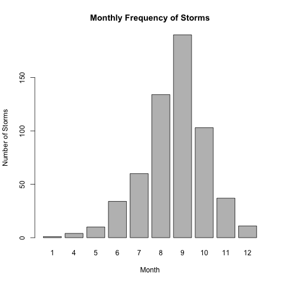

Now, we will count the number of tropical storms per month in the same time-frame, where a wind speed of 35 knots or greater constitutes a tropical storm.

```{r, echo=FALSE}
tapply( group3$x, group3$Group.2, length)
```
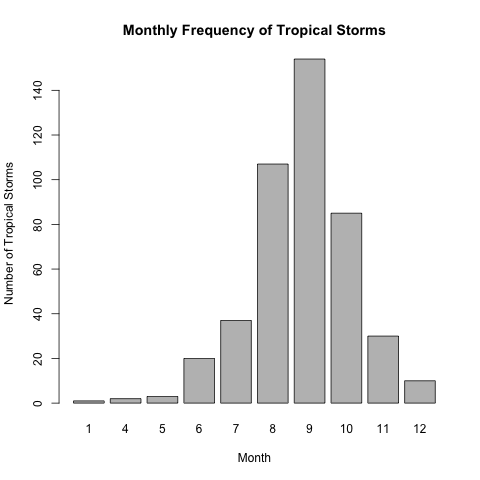

We now turn our eyes to the number of hurricanes per month, where a wind speed of 64 knots or greater indicates a hurricane. 

```{r, echo=FALSE}
tapply(group4$x, group4$Group.2, length)                 
```
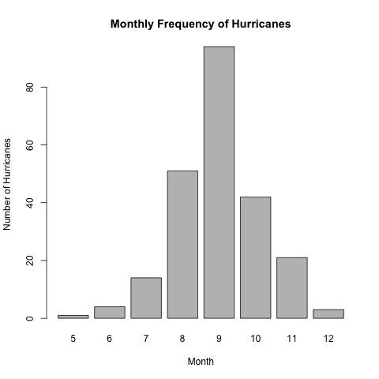

Lastly, we look at the number of stage 3 hurricanes per month.

```{r, echo=FALSE}
tapply(group5$x, group5$Group.2, length)
```
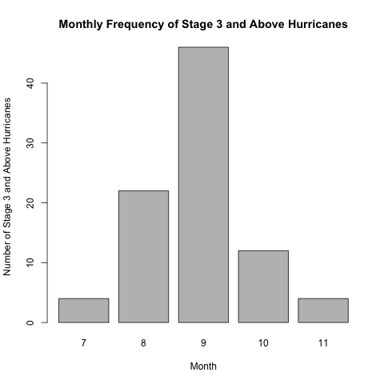

Each of these plots serves to tell us that storms occur with the greatest frequency in the summer to early fall months, where the temperatures are the highest. It also exhibits, through the intervals of months getting smaller in each successive plot, that each higher stage storm necessitates higher temperatures. This further adds credibility to our hypothesis that the increasing temperatures induced by global warming have led to the increasing intensity of storms.

#Summary Statistics for the annual number of storms

```{r, echo=FALSE}
storms_summary
```

With these statistics presented in table for us, we can see the average in each case, and then go back and compare the average to each table.

First, we will compare the number of tropical storms in each year to the average.
```{r, echo=FALSE}
tapply( group$x, group$Group.2, length)>=12.1
```
With this, we can see that the time period from 1980-1995 had only three tropical storms surpassing the average, whereas the time period from 1996-2010 had 10.

Second, we will compare the number of hurricanes in each year to the average.
```{r, echo=FALSE}
tapply( group1$x, group1$Group.2, length)>=6.6
```
With this, we can see that the time period from 1980-1995 had only six tropical storms surpassing the average, whereas the time period from 1996-2010 had 11.

Last we will compare the number of stage 3 hurricanes per year to the average.
```{r, echo=FALSE}
tapply( group2$x, group2$Group.2, length)>=2.8
```
With this, we can see that the time period from 1980-1995 had only four tropical storms surpassing the average, whereas the time period from 1996-2010 had 10.

This adds numeric evidence to the already existing visual evidence that later stage storms have increased in frequency in the latter half of our data set, and thus in recent times. 

#A regression Analysis on Median and Mean Wind Speed and Pressure from 1980-2010 

First we will look at a regression analysis on mean wind speed and pressure

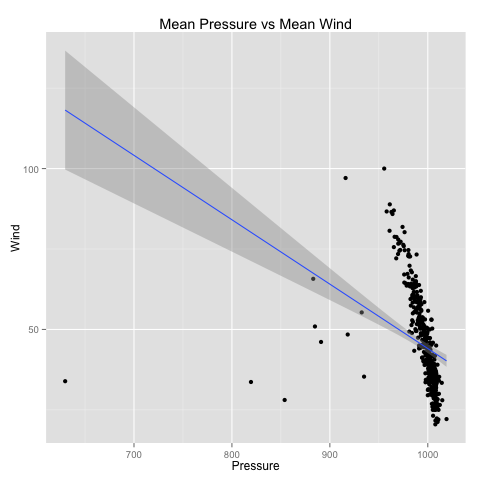
The results from this first regression seem a bit skewed by the outliers present. Because of this we attempted to plot again without the outliers, and the following plot was obtained.

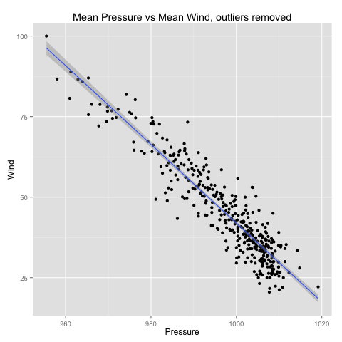
From this graph, it is apparent that there is a strong negative correlation between wind speed and pressure. 

Now we look at this same plot but for the medians

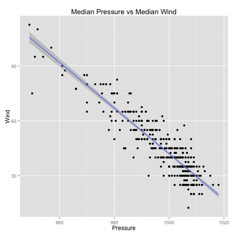

Once again we see a strong negative correlation between wind speed and pressure. This is outside the scope of this project, but there exists a causal relationship between pressure and wind, whereby the process of the pressure of the atmosphere going from higher to lower values induces higher wind speeds. This fact bears out in the regression analysis.

#Tracking storms in the North Atlantic and Eastern Pacific from 1980-2010

First we will compare the tracks of storms in the Atlantic and the Pacific

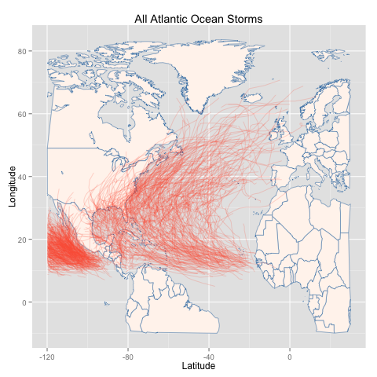

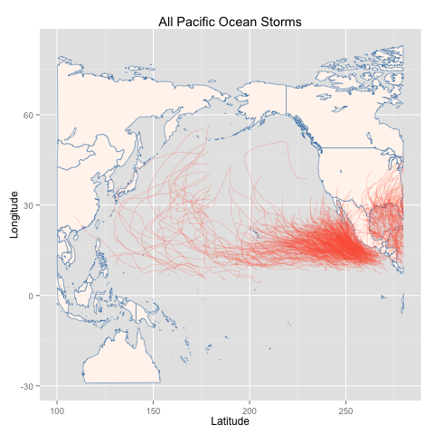

In the Atlantic basin, we see that storms are pretty spread out between the North American and African/European continents. In the Pacific basin, we see that most of the storms are concentrated near the western coast of Mexico, with few moving towards Japan or the western Canadian coast.

Next we will split along basin and compare those storms in each decade to each other, starting with the Atlantic basin

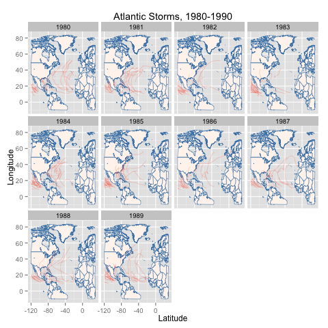

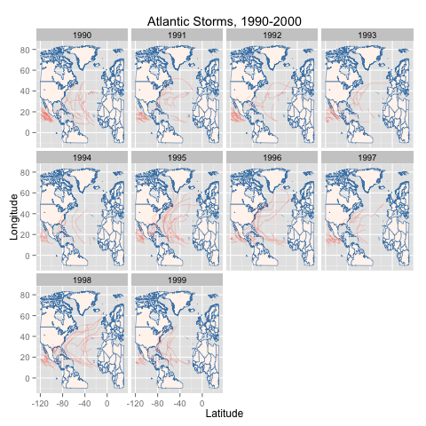

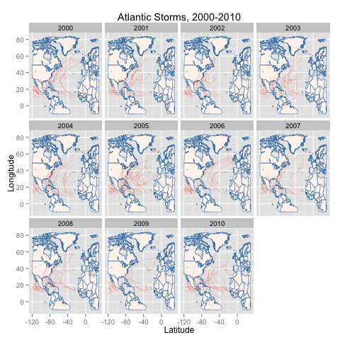

Once again, these plots appear to depict the fact that there have been higher concentrations of storms in the latter decades of our time frame, at least in the Atlantic basin.

Now we compare those in the Pacific basin

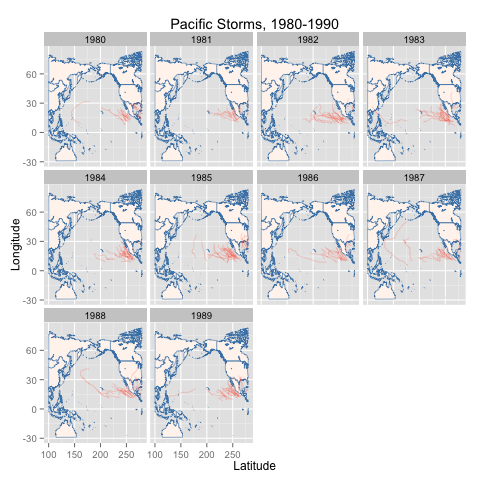

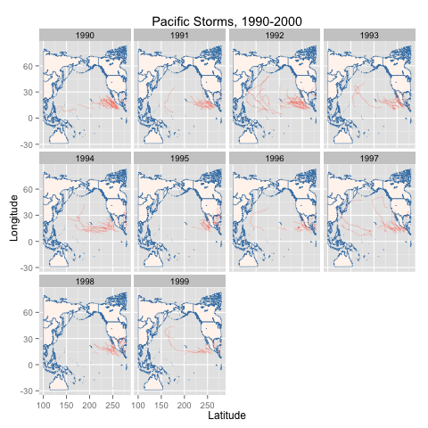

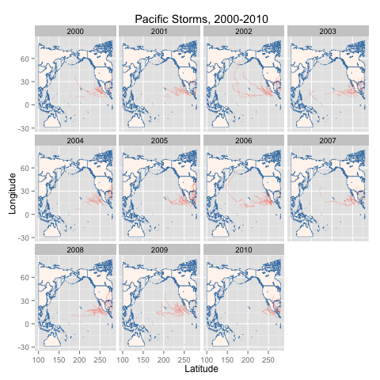

Based on the longer tails, and the higher concentrations, it appears that once again storms have gotten worse in the latter decades of our time frame, this time as manifested in the Pacific basin.

#Conclusion

In conclusion, from all the data present, we believe there is sufficient evidence to believe that storms have gotten worse in frequency and intensity in the latter half of the time frame selected. Though it is only a small window, we believe that this effect can be attributed to the rising temperature values of the earth caused by global warming, a fact which bears out by there being both a higher frequency and intensity of storms in the summer months where temperature is the highest.

#Extra Credit

Git hub Repo: https://github.com/PaulKim1995/Final_Project

Social Media Evidence: 

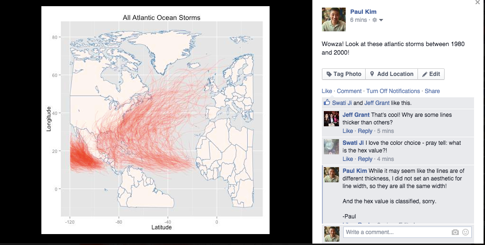


